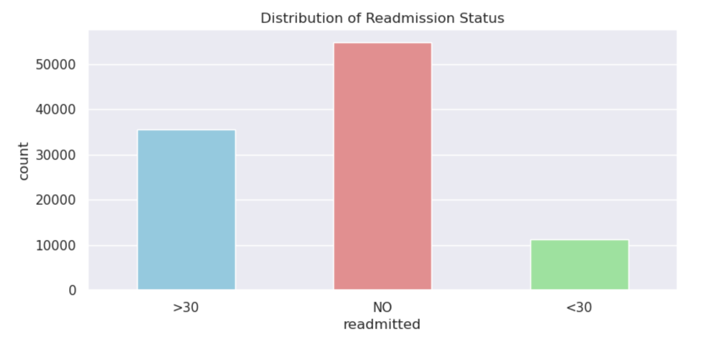

# Predicting 30-Day Hospital Readmission in Diabetes Patients: An End-to-End Machine Learning Project

## Project Overview

This project aims to leverage machine learning to predict the likelihood of 30-day hospital readmission for patients with diabetes. By accurately identifying high-risk patients, we can empower healthcare providers to implement targeted interventions, ultimately reducing readmissions, improving patient outcomes, and optimizing resource allocation.

## Business Value

This project addresses a critical challenge in the healthcare industry, where reducing readmission rates is a key performance indicator. By deploying a predictive model, hospitals can:

Improve Patient Care: Identify high-risk patients and provide additional support (follow-up appointments, medication management, self-care education).

Reduce Costs: Avoid the financial burden of unplanned readmissions.

Optimize Resource Allocation: Focus resources on high-risk patients.

Enhance Hospital Reputation: Demonstrate a commitment to patient well-being and quality of care.

## Data Source

Dataset: Diabetes 130- US Hospitals for Years 1999-2008 from UC Irvine Machine Learning Repository

The dataset represents ten years (1999-2008) of clinical care at 130 US hospitals and integrated delivery networks. Each row concerns hospital records of patients diagnosed with diabetes, who underwent laboratory, medications, and stayed up to 14 days. The goal is to determine the readmission of the patient within 30 days of discharge. The problem is important for the following reasons. Despite high-quality evidence showing improved clinical outcomes for diabetic patients who receive various preventive and therapeutic interventions, many patients do not receive them. This can be partially attributed to arbitrary diabetes management in hospital environments, which fail to attend to glycemic control. Failure to provide proper diabetes care not only increases the managing costs for the hospitals (as the patients are readmitted) but also impacts the morbidity and mortality of the patients, who may face complications associated with diabetes.

## Refined Problem Statement

Hospital readmissions within 30 days of discharge are a significant concern in healthcare. Our project will develop a machine learning model to predict the probability of 30-day readmission for patients with diabetes, enabling healthcare providers to intervene and improve patient outcomes.

## Methodology

### 1. Data Upload and Preprocessing (PostgreSQL pgAdmin 4)

Import: The raw dataset (CSV) is imported into a PostgreSQL database.

Cleaning: Missing values are handled, data types are converted (e.g., age to ordered categorical), and columns with excessive missing values are dropped (e.g., max_glu_serum, A1Cresult).

Preparation: The cleaned dataset is exported to a CSV file for further analysis.

### 2. Exploratory Data Analysis and Model Development (AWS SageMaker Jupyter Notebook)

Analysis: The dataset is loaded into a Jupyter notebook in AWS SageMaker.

Visualization: Exploratory data analysis is performed to uncover insights and relationships within the data.

Model Building: Various machine learning models are developed and evaluated to select the best performing model for predicting readmission.

### 3. Model Deployment 

Documentation: The entire project, including data preprocessing steps, code for analysis and model development, and model evaluation results, is thoroughly documented in this repository's README file.

Code: Jupyter notebook(s) containing the analysis and model development are available in the repository, 'diabetes-j-notebook.ipynb'.

#### Distribution of Readmission Status

The bar chart displaying the distribution of readmission status among patients reveals a significant imbalance. The majority of patients were not readmitted (labeled as "NO"), with approximately 54,864 instances. This is followed by patients readmitted after more than 30 days ("">30"), accounting for around 35,000 instances. The smallest group consists of patients readmitted within 30 days ("<30"), with approximately 11,902 instances. This imbalance in the target variable indicates that most patients did not experience readmission, and only a smaller fraction were readmitted within the 30-day window, which is crucial for our prediction goal. Addressing this imbalance will be essential in the subsequent steps of model development to ensure the model's effectiveness and reliability in predicting readmissions.

# Initialize SageMaker session
session = sagemaker.Session()

# Define S3 paths for training and validation data
train_data_s3_path = 's3://your-bucket/train/train_data.csv'
validation_data_s3_path = 's3://your-bucket/validation/validation_data.csv'

# Define S3 paths for model artifacts
model_artifacts_s3_path = 's3://your-bucket/path/to/model.tar.gz'

# Ensure your data is in S3
s3_client = boto3.client('s3')
try:
    s3_client.head_object(Bucket='your-bucket', Key='train/train_data.csv')
    s3_client.head_object(Bucket='your-bucket', Key='validation/validation_data.csv')
except Exception as e:
    print("Ensure your data files are uploaded to S3:", e)

# Configure SageMaker Estimator
xgb = Estimator(
    image_uri=sagemaker.image_uris.retrieve("xgboost", session.boto_region_name, version="1.2-1"),
    role=sagemaker.get_execution_role(),
    instance_count=1,
    instance_type='ml.m5.large',
    output_path='s3://your-bucket/output/',
    model_uri=model_artifacts_s3_path  # Specify the model artifacts path
)

# Train the model (or skip this step if model artifacts are already available)
xgb.fit({'train': TrainingInput(train_data_s3_path), 'validation': TrainingInput(validation_data_s3_path)})

# Deploy the model
predictor = xgb.deploy(initial_instance_count=1, instance_type='ml.m5.large')

# Example prediction (ensure your test data is prepared)
test_data = pd.read_csv('test_data.csv')  # Load your test data
predictions = predictor.predict(test_data)

print(predictions)
