## Predicting 30-Day Hospital Readmission in Diabetes Patients: An End-to-End Machine Learning Project

### I- Project Overview

This project aims to leverage machine learning to predict the likelihood of 30-day hospital readmission for patients with diabetes. By accurately identifying high-risk patients, we can empower healthcare providers to implement targeted interventions, ultimately reducing readmissions, improving patient outcomes, and optimizing resource allocation.

### II- Business Value

This project addresses a critical challenge in the healthcare industry, where reducing readmission rates is a key performance indicator. By deploying a predictive model, hospitals can:

Improve Patient Care: Identify high-risk patients and provide additional support (follow-up appointments, medication management, self-care education).

Reduce Costs: Avoid the financial burden of unplanned readmissions.

Optimize Resource Allocation: Focus resources on high-risk patients.

Enhance Hospital Reputation: Demonstrate a commitment to patient well-being and quality of care.

### III- Data Source

Dataset: Diabetes 130- US Hospitals for Years 1999-2008 from UC Irvine Machine Learning Repository

The dataset represents ten years (1999-2008) of clinical care at 130 US hospitals and integrated delivery networks. Each row concerns hospital records of patients diagnosed with diabetes, who underwent laboratory, medications, and stayed up to 14 days. The goal is to determine the readmission of the patient within 30 days of discharge. The problem is important for the following reasons. Despite high-quality evidence showing improved clinical outcomes for diabetic patients who receive various preventive and therapeutic interventions, many patients do not receive them. This can be partially attributed to arbitrary diabetes management in hospital environments, which fail to attend to glycemic control. Failure to provide proper diabetes care not only increases the managing costs for the hospitals (as the patients are readmitted) but also impacts the morbidity and mortality of the patients, who may face complications associated with diabetes.

### IV- Refined Problem Statement

Hospital readmissions within 30 days of discharge are a significant concern in healthcare. Our project will develop a machine learning model to predict the probability of 30-day readmission for patients with diabetes, enabling healthcare providers to intervene and improve patient outcomes.

### V- Methodology

#### 1. Data Upload and Preprocessing (PostgreSQL pgAdmin 4)

Import: The raw dataset (CSV) is imported into a PostgreSQL database.

Cleaning: Missing values are handled, data types are converted (e.g., age to ordered categorical), and columns with excessive missing values are dropped (e.g., max_glu_serum, A1Cresult).

Preparation: The cleaned dataset is exported to a CSV file for further analysis.

#### 2. Exploratory Data Analysis and Model Development (AWS SageMaker Jupyter Notebook)

Analysis: The dataset is loaded into a Jupyter notebook in AWS SageMaker.

Visualization: Exploratory data analysis is performed to uncover insights and relationships within the data.

Model Building: Various machine learning models are developed and evaluated to select the best performing model for predicting readmission.

#### 3. Model Deployment 

Documentation: The entire project, including data preprocessing steps, code for analysis and model development, and model evaluation results, is thoroughly documented in this repository's README file.

Code: Jupyter notebook(s) containing the analysis and model development are available in the repository, 'diabetes-j-notebook.ipynb'.

### VI- Dataset EDA Analysis 

##### 1. Analysis of the Diabetes Dataset for Numeric Columns

The dataset comprises information from 101,766 encounters, each represented by a unique encounter_id and patient_nbr. These identifiers serve as unique keys, ensuring each record is distinct.

A significant aspect of the dataset is the distribution of admission_type_id, with a mean value of 2.02. The majority of admissions fall under the lower-numbered categories, with the median value being 1, indicating that the most frequent admission type is category 1. Similarly, the discharge_disposition_id shows a mean of 3.72, but the median value is 1, suggesting that most discharges fall under category 1. The admission_source_id reveals a variety of admission sources, with a median value of 7, pointing to category 7 as a common source.

The average length of stay in the hospital (time_in_hospital) is approximately 4.40 days, with a median of 4 days, indicating that half of the patients stay for four days or less. This is coupled with a high number of lab procedures per encounter, with an average of 43 procedures and a median of 44, showing that extensive testing is typical for these patients.

Patients typically undergo about one procedure (num_procedures), and the average number of medications prescribed (num_medications) is 16, highlighting the complexity of managing diabetes, which often involves multiple medications. Despite the high average, the number of outpatient (number_outpatient), emergency (number_emergency), and inpatient visits (number_inpatient) are relatively low, with most patients not having these visits. However, the variability in these counts suggests that a subset of patients experiences frequent visits.

The dataset also reveals a high number of diagnoses per patient, with an average of 7.42 diagnoses, underscoring the multifaceted nature of diabetes and its associated conditions.

The dataset highlights the extensive medical interactions and complex management required for diabetic patients, with multiple medications and frequent lab procedures being the norm. The dominance of specific admission types, discharge dispositions, and admission sources will be crucial areas for further analysis. Understanding these patterns will be essential for predicting readmission rates and improving patient outcomes.

#### 2. Analysis of the Diabetes Dataset for Categorical Columns

The categorical summary of the diabetes dataset reveals several key insights into the patient demographics and medical characteristics. The dataset includes six unique races, with Caucasians forming the majority at 76,099 instances. Gender distribution shows a higher frequency of females, accounting for 54,708 records. The age distribution is divided into ten categories, with the most common age group being 70-80 years, comprising 26,068 patients.

A significant portion of the dataset has missing or unspecified values in the payer_code and medical_specialty columns, marked by the top value '?', appearing 40,256 and 49,949 times, respectively. This indicates a need for careful handling of these missing values during analysis.

In terms of diagnoses, there is a substantial variety, with diag_1 having 717 unique codes, diag_2 having 749, and diag_3 having 790. The most frequent primary diagnosis code (428) appears 6,862 times.

Medication use is also diverse, though the top value for all medications is 'No', indicating that many patients are not on these specific medications. For instance, 81,778 records indicate no use of metformin, and 100,227 indicate no use of repaglinide. However, insulin usage is significant, with 47,383 instances, which is to be expected for diabetes patients.

Most patients have not experienced changes in their medication regimens (change column), and the majority are on diabetes medication (diabetesMed column), with 78,363 records indicating 'Yes'.

The readmitted column, which is crucial for our prediction goal, shows three unique values with 'NO' being the most frequent, appearing 54,864 times.

These insights highlight the need for targeted analysis and feature engineering, especially in handling missing values and understanding the impact of various demographic and medical features on readmission rates. The prevalence of certain diagnoses, the extensive non-use of many medications, and the high rate of specific readmission outcomes will be critical in building predictive models.

#### 3. Readmission Status

#### Distribution of Readmission Status

The bar chart displaying the distribution of readmission status among patients reveals a significant imbalance. The majority of patients were not readmitted (labeled as "NO"), with approximately 54,864 instances. This is followed by patients readmitted after more than 30 days ("">30"), accounting for around 35,000 instances. The smallest group consists of patients readmitted within 30 days ("<30"), with approximately 11,902 instances. This imbalance in the target variable indicates that most patients did not experience readmission, and only a smaller fraction were readmitted within the 30-day window, which is crucial for our prediction goal. Addressing this imbalance will be essential in the subsequent steps of model development to ensure the model's effectiveness and reliability in predicting readmissions.

### 4. Age Distribution

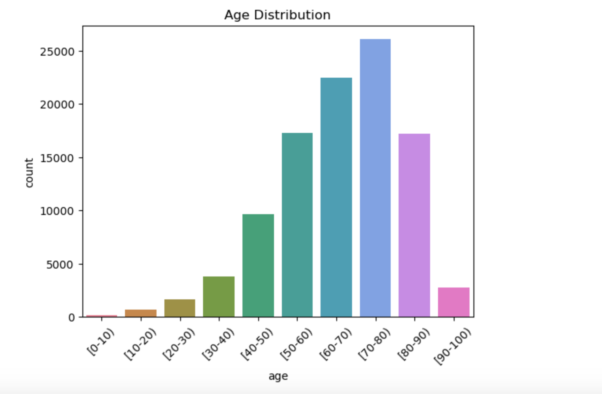

#### Age Distribution Analysis

The age distribution chart indicates that the majority of patients in the dataset are older adults, with the most represented age groups being 70-80 and 60-70, comprising around 26,000 and 23,000 patients, respectively. This is followed by the 50-60 age group, with approximately 17,000 patients. The youngest age groups (e.g., 0-10, 10-20, and 20-30) have very few patients, suggesting that the dataset predominantly includes older individuals. This age distribution aligns with the typical demographic for diabetes patients, who are more likely to be older adults. Understanding this age distribution is crucial for tailoring the predictive model and potential interventions to the demographic most at risk of readmission.

#### 5. Gender Distribution

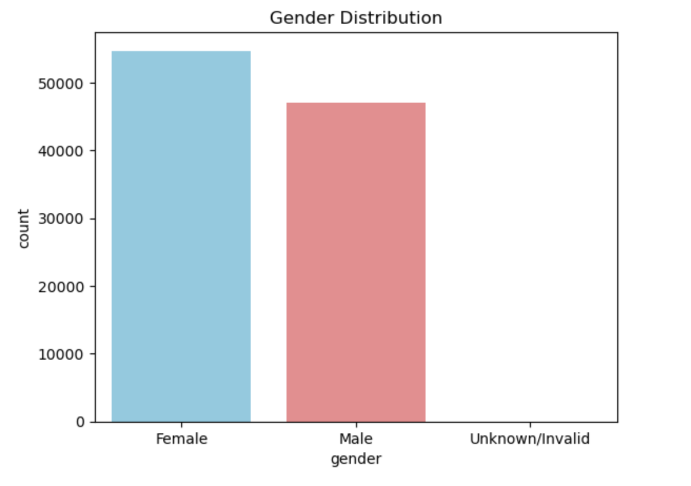

#### Gender Distribution Analysis

The gender distribution chart reveals that the dataset consists predominantly of female patients, making up a slight majority compared to male patients. Specifically, there are slightly more female patients than male patients. Additionally, there is a small category labeled "Unknown/Invalid," indicating some entries with missing or invalid gender information. This distribution suggests that while the dataset is fairly balanced between male and female patients, any analysis or modeling should consider the presence of entries with unspecified gender, which may need to be handled appropriately during data preprocessing.

#### 6. Race Distribution

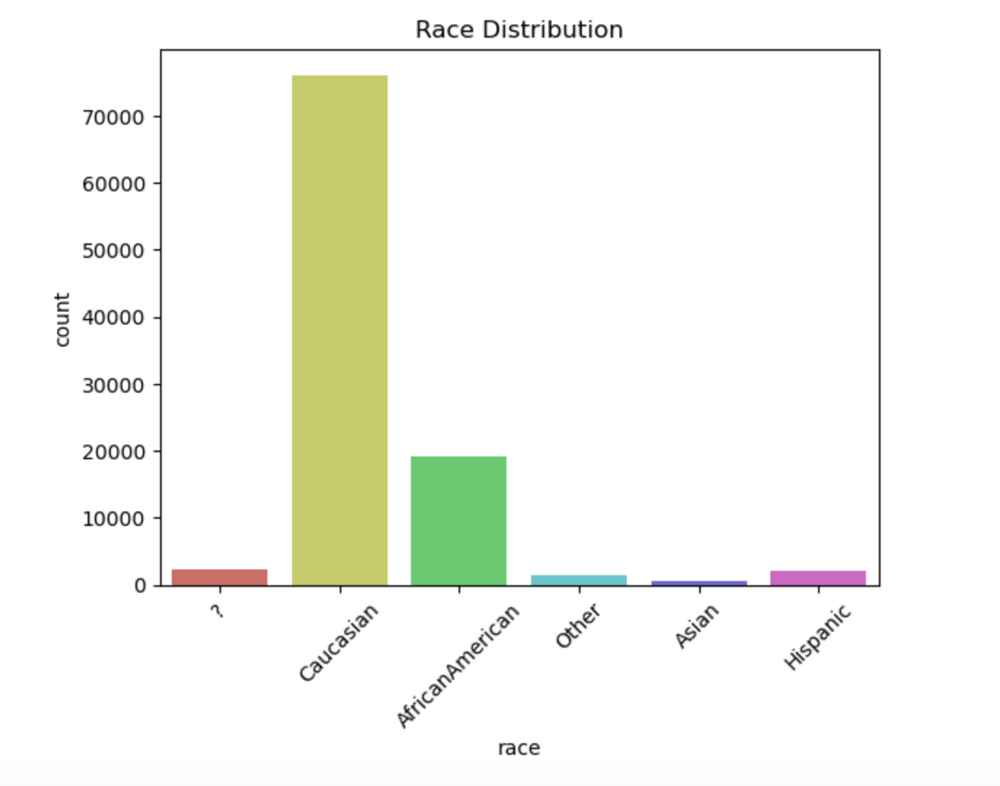

##### Race Distribution Analysis

The race distribution chart highlights a significant predominance of Caucasian patients in the dataset, constituting the majority by a large margin. African American patients form the second-largest group but are considerably fewer in number compared to Caucasian patients. The categories 'Other,' 'Asian,' and 'Hispanic' are represented minimally, indicating a less diverse dataset. Additionally, there is a small portion of entries with unspecified race labeled as '?'. This imbalance suggests that the dataset may not fully represent the diversity of the broader population, and any analysis or modeling should account for this skew to ensure generalizability and fairness.

#### 7. Correlation Matrix

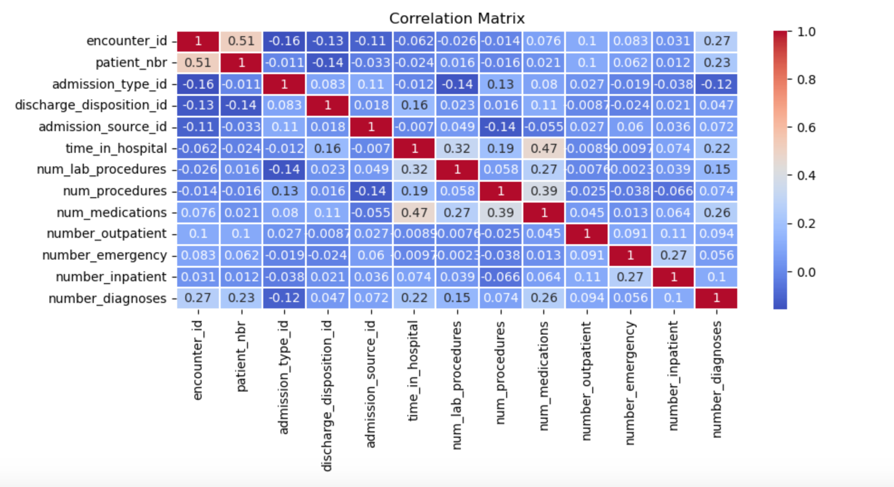

##### Correlation Matrix Analysis

The correlation matrix provides insights into the relationships between various numeric features in the dataset. The highest positive correlations are observed between num_medications and number_inpatient (0.39), as well as num_medications and number_outpatient (0.27), indicating that patients with more medications tend to have more inpatient and outpatient visits. Additionally, time_in_hospital shows a moderate correlation with num_lab_procedures (0.32) and num_medications (0.47), suggesting that longer hospital stays are associated with more lab procedures and medications. Most other correlations are relatively low, indicating that there are no strong linear relationships between the majority of numeric features. This suggests that a combination of multiple features will likely be necessary to build an effective predictive model for hospital readmission.

#### 8. Boxplots 

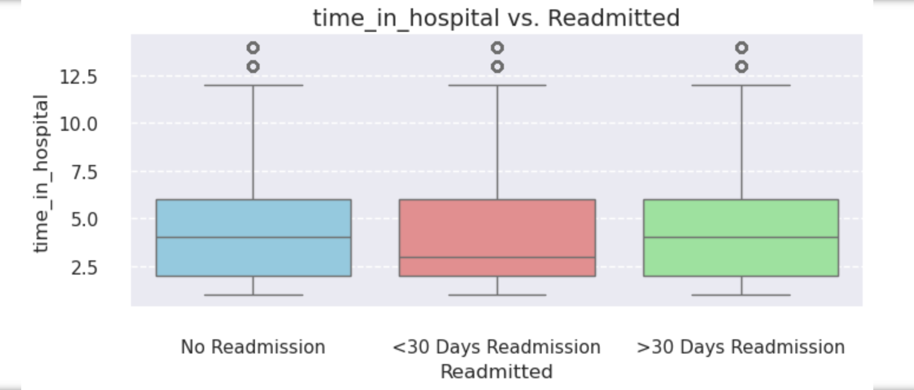

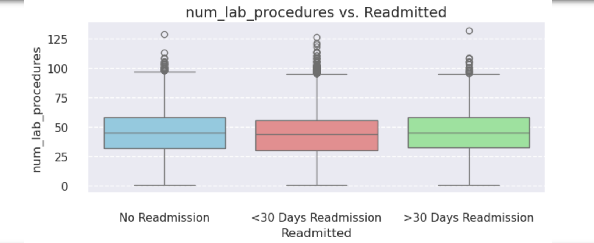

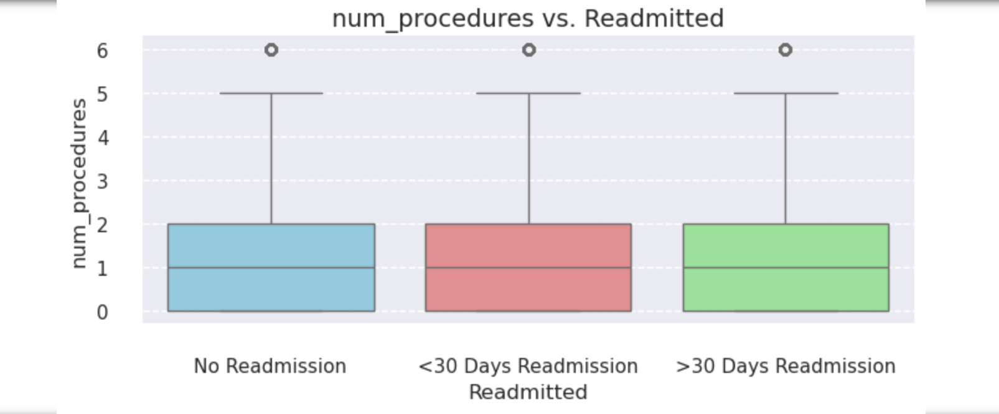

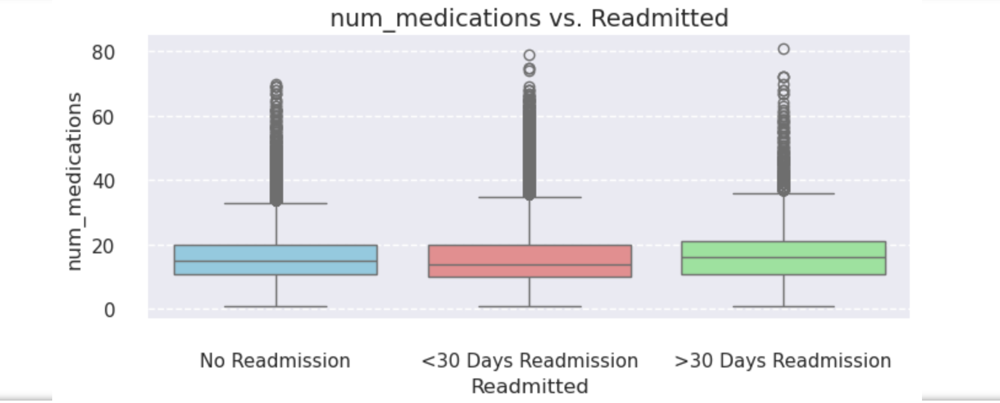

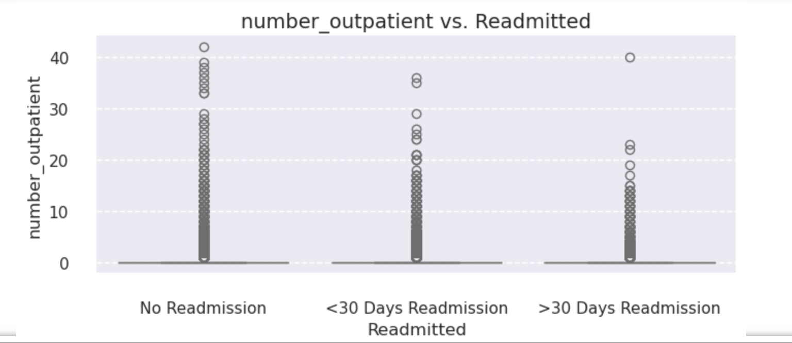

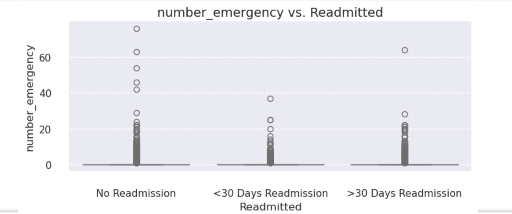

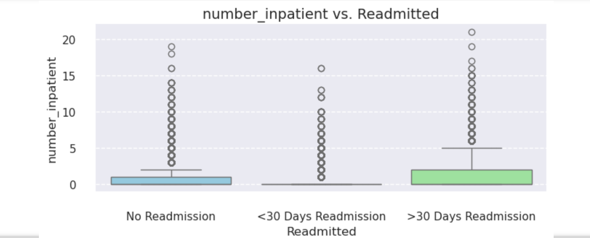

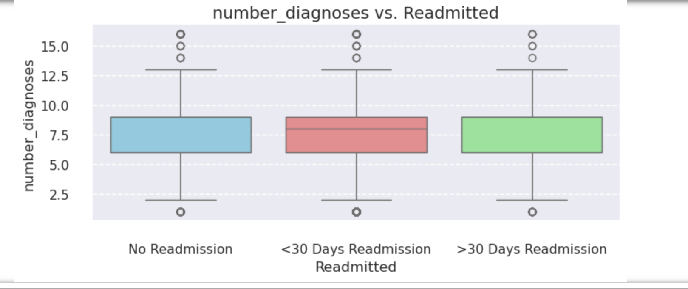

##### Boxplots Analysis

The boxplots provide a visual summary of the distribution of various numeric features in relation to the readmission status of patients. Here are the key insights:

**Time in Hospital vs. Readmitted**: The median time in the hospital is consistent across different readmission statuses. Patients who are not readmitted tend to have a shorter hospital stay compared to those readmitted within 30 days or after 30 days.

**Num Lab Procedures vs. Readmitted**: The number of lab procedures does not show a significant difference across different readmission statuses. The distribution is fairly consistent, indicating that the number of lab procedures might not be a strong indicator of readmission.

**Num Procedures vs. Readmitted**: Similar to lab procedures, the number of procedures does not vary significantly across different readmission statuses. This suggests that the number of procedures is not a major factor in predicting readmission.

**Num Medications vs. Readmitted**: The number of medications shows a slight increase for patients not readmitted compared to those readmitted within 30 days. This might indicate that better medication management could potentially reduce the chances of early readmission.

**Number Outpatient vs. Readmitted**: The number of outpatient visits appears higher for patients not readmitted, suggesting that regular outpatient follow-ups might help in reducing readmissions.

**Number Emergency vs. Readmitted**: The number of emergency visits shows a wider range for patients not readmitted, indicating that those not readmitted might have had more emergency visits managed effectively.

**Number Inpatient vs. Readmitted**: The number of inpatient stays is slightly higher for patients readmitted within 30 days, suggesting a potential correlation between inpatient frequency and readmission risk.

**Number Diagnoses vs. Readmitted**: The number of diagnoses is higher for patients readmitted within 30 days, which could indicate that patients with more diagnoses are at a higher risk of early readmission.

These insights provide a foundation for understanding which features may influence patient readmission and guide further feature engineering and model development.

#### 9. Distribution of Admission Type, Discharge Disposition and Admission Source

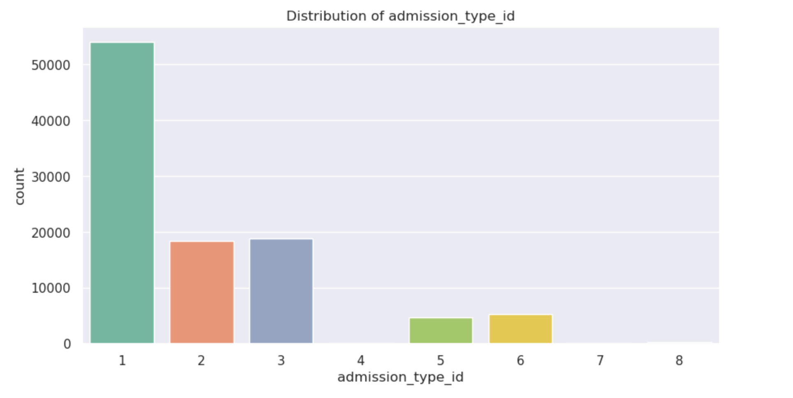

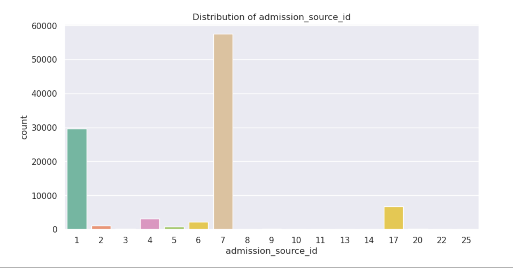

##### Distribution of Admission Type, Discharge Disposition and Admission Source Analysis

The charts for admission_type_id, discharge_disposition_id, and admission_source_id provide important insights into the dataset's composition and patient flow within the hospital system.

**Admission Type Distribution**: The majority of admissions are of type 1, which is likely to be emergency admissions, indicating that most patients are admitted under urgent circumstances. Other admission types such as 2 and 3 also have significant counts, representing elective and other scheduled admissions.

**Discharge Disposition Distribution**: A large proportion of patients are discharged to home (1), followed by discharge to home with home health care (6). The high count for discharged to home suggests that many patients recover sufficiently to go back to their homes without additional healthcare services.

**Admission Source Distribution**: Most admissions come from the emergency room (7), followed by physician referral (1). This highlights the role of the emergency room as a primary entry point for patients, with a significant number also being referred by healthcare professionals.

These distributions highlight the emergency-driven nature of hospital admissions in this dataset and the prevalent discharge practices, which are crucial for understanding patient flow and resource allocation in the hospital setting.

### VII- XGBoost Model

# Initialize SageMaker session
session = sagemaker.Session()

# Define S3 paths for training and validation data
train_data_s3_path = 's3://your-bucket/train/train_data.csv'
validation_data_s3_path = 's3://your-bucket/validation/validation_data.csv'

# Define S3 paths for model artifacts
model_artifacts_s3_path = 's3://your-bucket/path/to/model.tar.gz'

# Ensure your data is in S3
s3_client = boto3.client('s3')
try:
    s3_client.head_object(Bucket='your-bucket', Key='train/train_data.csv')
    s3_client.head_object(Bucket='your-bucket', Key='validation/validation_data.csv')
except Exception as e:
    print("Ensure your data files are uploaded to S3:", e)

# Configure SageMaker Estimator
xgb = Estimator(
    image_uri=sagemaker.image_uris.retrieve("xgboost", session.boto_region_name, version="1.2-1"),
    role=sagemaker.get_execution_role(),
    instance_count=1,
    instance_type='ml.m5.large',
    output_path='s3://your-bucket/output/',
    model_uri=model_artifacts_s3_path  # Specify the model artifacts path
)

# Train the model (or skip this step if model artifacts are already available)
xgb.fit({'train': TrainingInput(train_data_s3_path), 'validation': TrainingInput(validation_data_s3_path)})

# Deploy the model
predictor = xgb.deploy(initial_instance_count=1, instance_type='ml.m5.large')

# Example prediction (ensure your test data is prepared)
test_data = pd.read_csv('test_data.csv')  # Load your test data
predictions = predictor.predict(test_data)

print(predictions)
